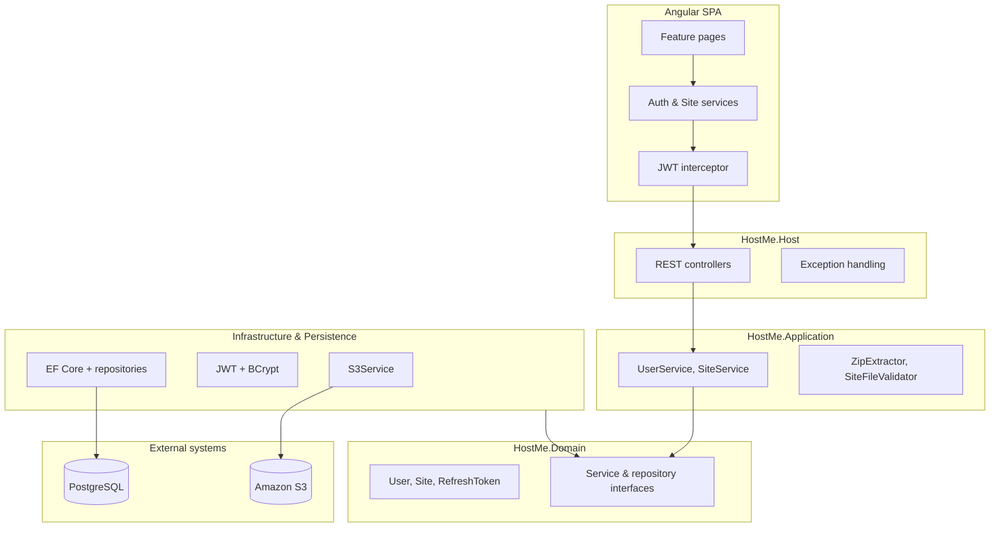
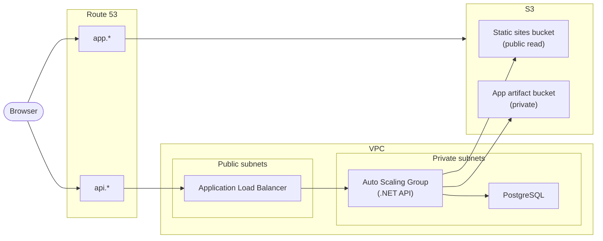

# HostMe

HostMe is a static site hosting platform. Users register, upload a ZIP archive containing their website, and receive a public URL. The project is a monorepo with an **Angular** SPA and an **ASP.NET Core** API backed by **PostgreSQL** and **Amazon S3**.

---

## Repository structure

```
hostme/
├── hostme.frontend/          # Angular SPA
│   └── src/app/
│       ├── core/             # Guards, interceptors, services, models
│       └── features/
│           ├── auth/         # Login & registration
│           └── dashboard/    # Profile & site management
│
└── hostme.backend/           # .NET solution
    ├── HostMe.Host/          # HTTP API, middleware, DI composition
    ├── HostMe.Application/   # Business logic & use cases
    ├── HostMe.Domain/        # Entities, interfaces, DTOs, constants
    ├── HostMe.Infrastructure/# JWT, BCrypt, AWS S3
    ├── HostMe.Persistance/   # EF Core, repositories, migrations
    └── *Tests/               # Unit & integration tests
```

---

## Application architecture

The backend follows **Clean Architecture** — business rules live at the center and infrastructure is a replaceable outer shell. Dependencies always point inward: Host → Application → Domain. Infrastructure and Persistence implement interfaces defined in Domain.



### Concepts used

| Concept | Where | Purpose |
|---------|-------|---------|
| **Clean Architecture** | Backend solution structure | Separates business logic from frameworks, databases, and cloud SDKs |
| **Repository pattern** | `HostMe.Persistance` | Abstracts data access behind `IUserRepository` / `ISiteRepository` |
| **Dependency injection** | `Program.cs` | Wires interfaces to implementations at startup |
| **DTOs & unified API envelope** | `HostMe.Domain` | All endpoints return `{ isError, data, errors }` for consistent client handling |
| **JWT + refresh tokens** | Auth flow | Short-lived access tokens with revocable refresh tokens stored in the database |
| **Global exception middleware** | `ExceptionHandlingMiddleware` | Maps domain exceptions to HTTP status codes in one place |
| **Feature-based modules** | Angular `features/` | Auth and dashboard are self-contained route modules with lazy loading |
| **Route guards** | `authGuard`, `guestGuard` | Protect authenticated routes and prevent logged-in users from seeing auth pages |
| **HTTP interceptor** | `token.interceptor` | Attaches the JWT to every outgoing API request automatically |

### Backend layers

| Layer | Responsibility |
|-------|----------------|
| **Host** | REST controllers, authentication, CORS, Swagger, middleware pipeline |
| **Application** | Use cases — registration, login, site upload/delete, ZIP extraction and validation |
| **Domain** | Entities, service interfaces, request/response models, error constants — no framework dependencies |
| **Infrastructure** | Concrete implementations: AWS S3 client, JWT generation, password hashing |
| **Persistence** | EF Core `DbContext`, PostgreSQL migrations, repository implementations |

### Frontend structure

The SPA uses **standalone components** with lazy-loaded feature routes. Shared concerns (auth state, API calls, token handling) live in `core/`; page-level UI lives in `features/`.

| Area | Purpose |
|------|---------|
| `core/guards/` | Route protection based on auth state |
| `core/interceptors/` | Automatic JWT attachment to API requests |
| `core/services/` | `AuthService`, `SiteService` — single source of truth for API communication |
| `features/auth/` | Login and registration |
| `features/dashboard/` | Profile, site list, upload, dashboard shell |

### Domain model

```
User
├── Id, Username, Email, PasswordHash, CreatedAt
├── RefreshTokens[]
└── Sites[]

Site
├── Id, UserId, Name, S3Key, Url, CreatedAt
└── User
```

### Site upload flow

1. User uploads a `.zip` via `POST /api/sites/upload`.
2. The archive is extracted to a temp directory with **ZipSlip protection**.
3. **SiteFileValidator** checks that `index.html` exists and all files match an allowlist (HTML, CSS, JS, images, fonts).
4. Validated files are uploaded to S3 under `sites/{email}/{slug}/`.
5. A `Site` record is saved in PostgreSQL with the public URL.

### API

| Method | Path | Auth | Description |
|--------|------|------|-------------|
| `POST` | `/api/auth/register` | — | Create account |
| `POST` | `/api/auth/login` | — | Login |
| `POST` | `/api/auth/refresh` | — | Refresh access token |
| `POST` | `/api/auth/revoke` | — | Revoke refresh token |
| `POST` | `/api/sites/upload` | JWT | Upload site ZIP |
| `GET` | `/api/sites` | JWT | List user's sites |
| `DELETE` | `/api/sites/{id}` | JWT | Delete site |

---

## AWS architecture

Production runs on AWS with a clear separation between **compute** (API), **storage** (static files), and **networking** (VPC isolation).



### Design decisions

| Decision | Rationale |
|----------|-----------|
| **Two S3 buckets** | User-hosted sites need public read access; API deployment artifacts stay private |
| **S3 static website hosting** | User sites are plain static files — no server-side rendering needed |
| **EC2 + Auto Scaling Group** | API runs as a stateless .NET process; ASG handles scaling and instance replacement |
| **Custom AMI + S3 artifact pull** | Instances boot from a pre-baked image and pull the latest build from a private bucket on startup |
| **Private subnets for compute & DB** | API and database are not directly internet-facing; only the ALB sits in public subnets |
| **Application Load Balancer** | Terminates HTTP traffic, health-checks API instances, enables zero-downtime deploys via instance refresh |
| **IAM instance roles** | EC2 instances authenticate to S3 without embedded credentials |
| **Route 53 split DNS** | Frontend (`app.*`) and API (`api.*`) are served from different origins |
| **VPC Flow Logs & S3 access logging** | Network and storage access auditing |

### Traffic flow

- **Dashboard (SPA)** — served from S3 static website hosting behind `app.*`
- **API requests** — routed through the ALB to EC2 instances in private subnets
- **User-hosted sites** — stored in a public S3 bucket, served directly via S3 website endpoints
- **Database** — PostgreSQL on a private EC2 instance, reachable only from the API security group

### Deployment model

CI/CD (planned via GitHub Actions) follows an **immutable artifact** pattern:

1. Build and publish the .NET API → upload to a private S3 bucket.
2. Trigger an Auto Scaling Group instance refresh — new instances pull the artifact on boot.
3. Build the Angular SPA → sync to the S3 bucket behind the frontend domain.

This avoids SSH-based deploys and keeps rollbacks as simple as redeploying a previous artifact.

---

## Local development

### Prerequisites

- [.NET 10 SDK](https://dotnet.microsoft.com/download)
- [Node.js 20+](https://nodejs.org/)
- PostgreSQL

### Backend

```bash
cd hostme.backend/HostMe.Host
dotnet ef database update --project ../HostMe.Persistance
dotnet run
```

### Frontend

```bash
cd hostme.frontend
npm install
npm start
```

The frontend runs at `http://localhost:4200`, the API at `http://localhost:5000` (Swagger enabled in Development).

Configuration is driven by `appsettings.json` and environment variables (`ConnectionStrings__DefaultConnection`, `Jwt__*`, `S3__*`).

### Tests

```bash
cd hostme.backend
dotnet test
```

---

## Tech stack

| Component | Technology |
|-----------|------------|
| Frontend | Angular 19, TypeScript, standalone components |
| Backend | ASP.NET Core (.NET 10), Clean Architecture |
| Database | PostgreSQL, Entity Framework Core |
| Object storage | Amazon S3 |
| Authentication | JWT + refresh tokens, BCrypt |
| Cloud | EC2, ALB, Auto Scaling, S3, Route 53, IAM, VPC |
